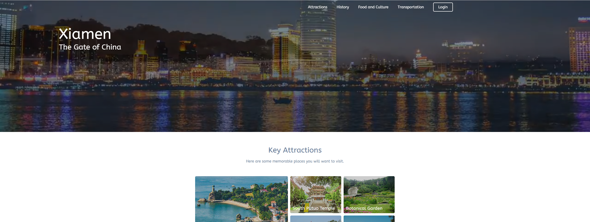
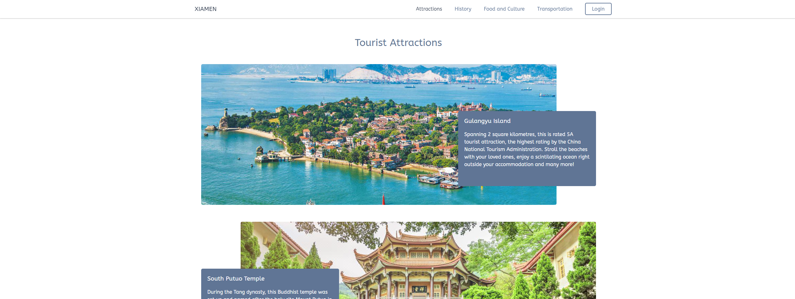
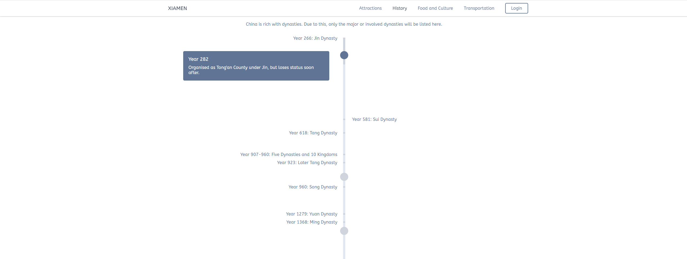
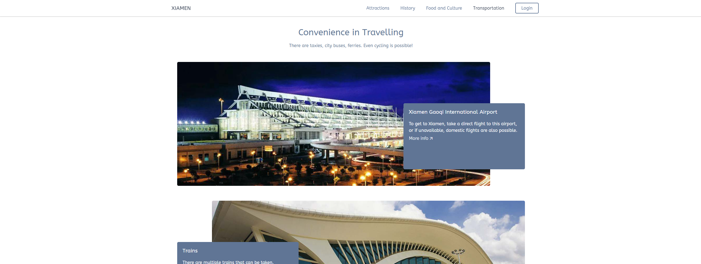
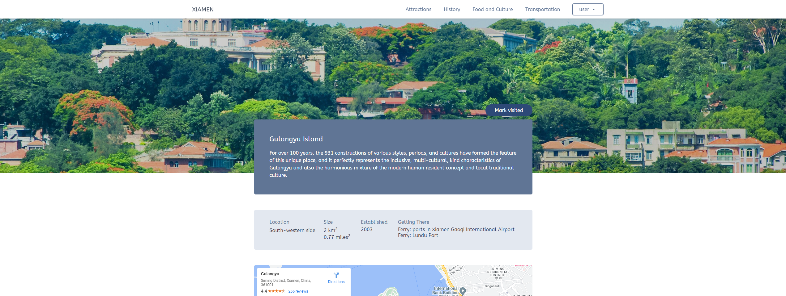
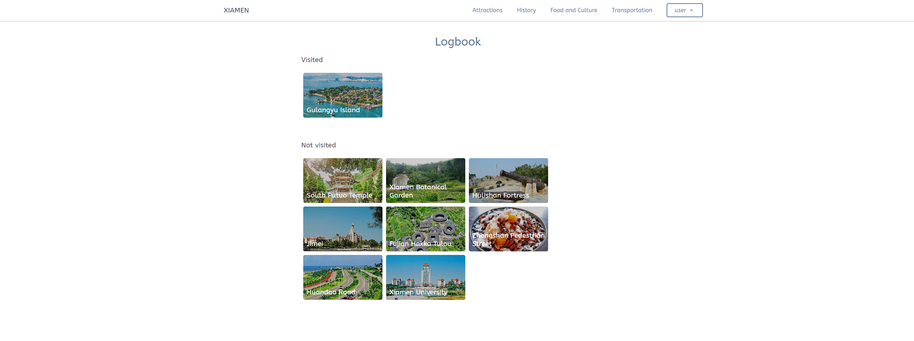

# Xiamen City
A tourist website about Xiamen City, China. An individual project for a course in 2020.

# Background
## Introduction
This website aims to invite and let tourists know the fascinating city of Xiamen. The site has the following:
- Contains attractions, descriptions and directions
- Allows tourists to know about the history of Xiamen
- Shows different transportations to travel there
- Promotes the colourful cuisine and culture

| Images |
| ------ |
|  |
|  |
|  |
|  |
|  |

## Logbook feature
The website also allows users to login to the site and save locations that they have visited.

